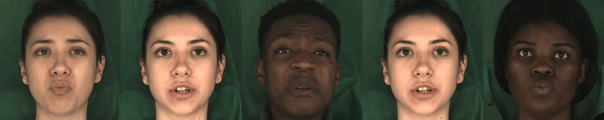

# Style The Talking Head

The image below show the results generated by our **StyleTheTalkingHead** system. From left to right, they are `Fake, ID, Exp, Pose` and `Content`. The `Fake` image retains the identity features of the `ID`, while adopting the expression from the `Exp`, the posture from the `Pose`, and the mouth shape from the `Content`.

## Abstract
The **Talking Head Generation** task aims to use generative models to drive a static portrait, producing a talking video of the person. In this study, we proposed a multimodal Talking Head Generation system, **StyleTheTalkingHead**, which not only controls the posture of the generated portrait through images but also controls facial expressions and mouth shape using audio signals or other images. This study was conducted and tested on the [MEAD dataset](https://github.com/uniBruce/Mead).

## Reference
1. [StyleGAN](https://arxiv.org/pdf/2006.06676)
2. [MEAD](https://wywu.github.io/projects/MEAD/support/MEAD.pdf)